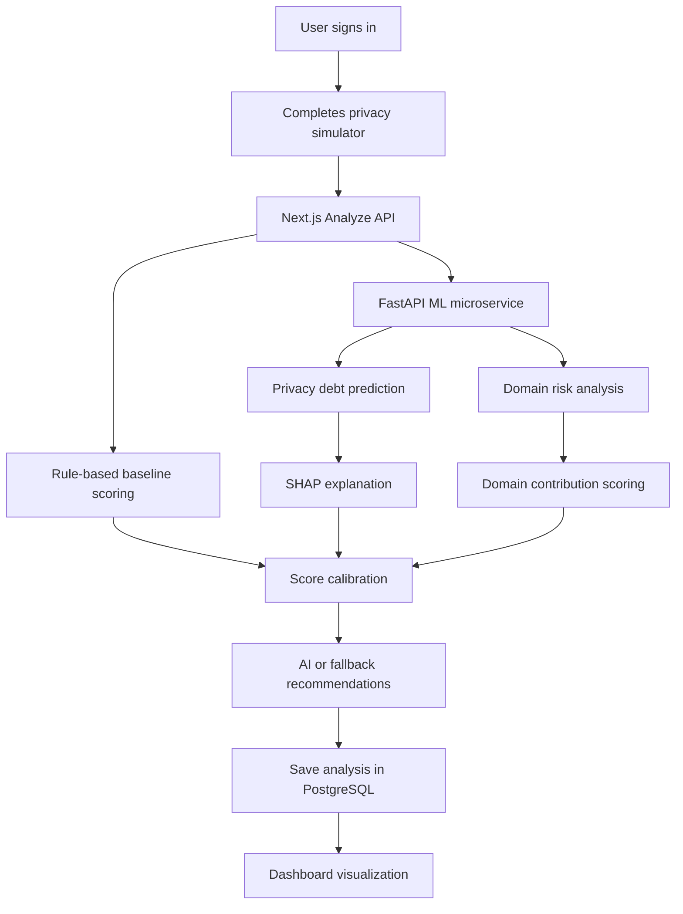
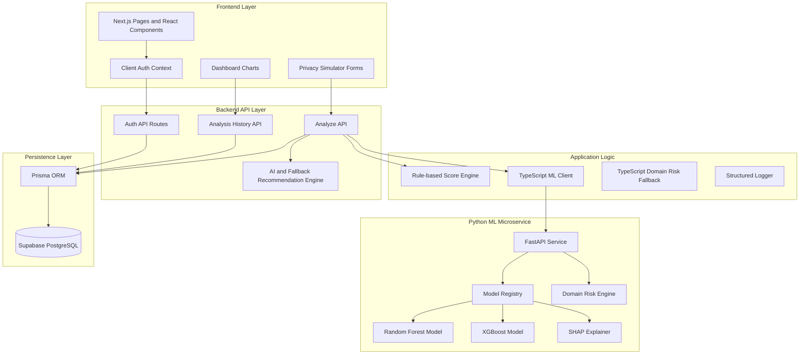
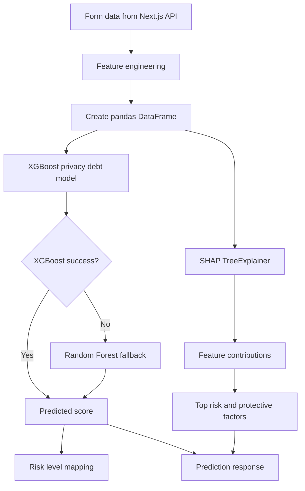
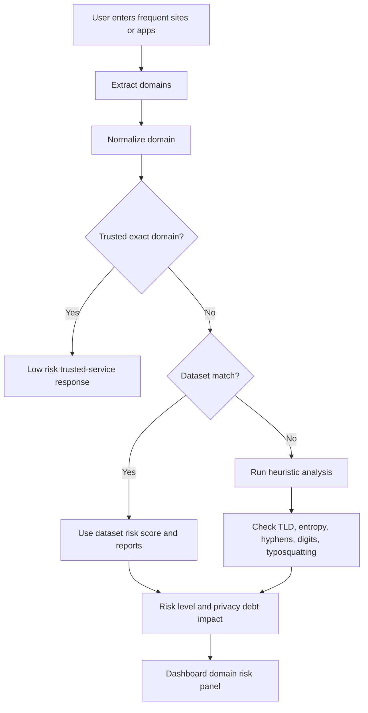
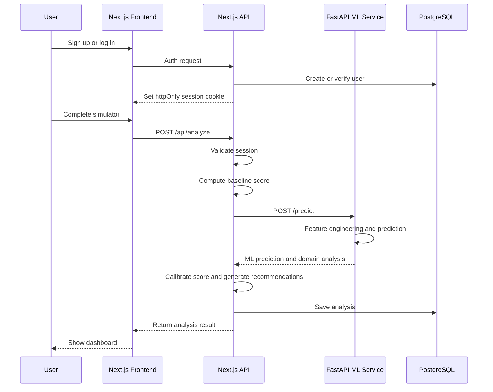
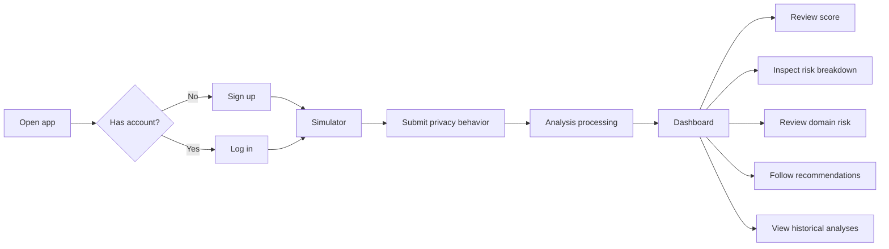
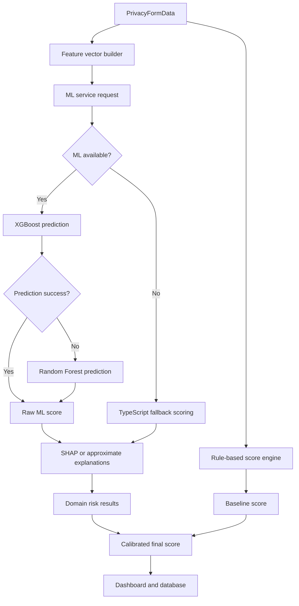
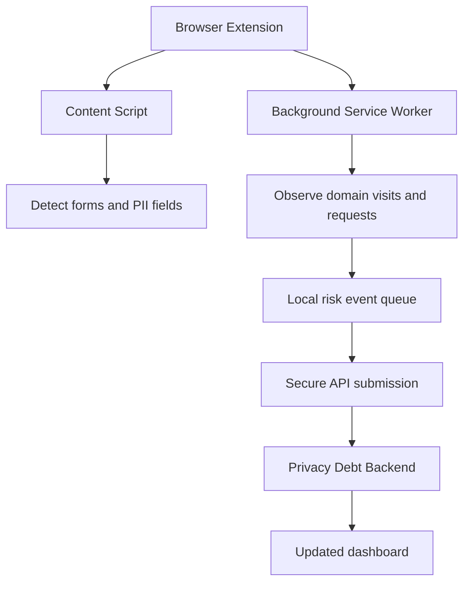

# Dynamic Privacy Debt Visualizer:
# A Real-time Browser-based Risk Quantification Framework

## 1. Title Page

**Project Title:** Dynamic Privacy Debt Visualizer: A Real-time Browser-based Risk Quantification Framework

**Project Domain:** Cybersecurity, Artificial Intelligence, Machine Learning, Web Security, Privacy Engineering

**Project Type:** Final Year Engineering Project

**Core Theme:** Quantification, visualization, and explainable analysis of cumulative digital privacy risk

**Technology Stack:**

- Frontend: Next.js 16, React 19, TypeScript, Tailwind CSS, shadcn/ui, Recharts
- Backend: Next.js API routes on Node.js, FastAPI ML microservice
- Database: PostgreSQL on Supabase, Prisma ORM
- Machine Learning: RandomForestRegressor, XGBoost Regressor, SHAP explainability
- Security: Password hashing, signed httpOnly cookies, protected APIs, server-side session validation

**Project Context:**

The project extends the original academic synopsis from the FF_180 progress review document. The initial idea focused on modeling privacy debt through user behavior simulation, risk scoring, dashboard visualization, and recommendation generation. The updated implementation advances this foundation into a full-stack architecture with database-backed authentication, persistent analysis history, ML-assisted privacy debt prediction, domain risk analysis, and explainable AI outputs.

---

## 2. Abstract

The Dynamic Privacy Debt Visualizer is a cybersecurity-oriented web application that quantifies how everyday digital behaviors accumulate into long-term privacy and security exposure. The project introduces the concept of Privacy Debt, inspired by Technical Debt, to represent the hidden cost created when users repeatedly make risky privacy decisions such as reusing passwords, accepting trackers, keeping inactive accounts, sharing sensitive personal information, using weak browser security practices, or interacting with suspicious domains.

Traditional privacy tools usually focus on isolated events: detecting a tracker, warning about a phishing site, listing browser permissions, or reporting a breach. These tools are useful, but they often fail to show how small privacy compromises compound over time. This project addresses that gap by estimating a dynamic privacy debt score from user behavior, domain interaction patterns, account footprint, authentication habits, and exposure indicators.

The system is implemented as a modern full-stack application. The frontend is built with Next.js 16, TypeScript, Tailwind CSS, shadcn/ui components, and Recharts. The backend uses Node.js API routes for authentication, scoring, persistence, and recommendation generation. A Python FastAPI microservice provides machine learning inference using RandomForestRegressor and XGBoost models. SHAP values are used to explain the most influential risk and protective factors. PostgreSQL, hosted on Supabase, stores users and historical analyses through Prisma ORM.

The project provides a privacy score dashboard, risk breakdown charts, platform exposure visualization, data exposure charts, domain-risk analysis, AI-assisted recommendations, and historical persistence. It is designed not merely as an academic demonstration but as a realistic engineering system that combines cybersecurity reasoning, ML prediction, explainability, secure backend design, and user-centered visualization.

---

## 3. Introduction

Modern users interact with a large number of digital platforms, including social media, email services, cloud storage, financial applications, e-commerce sites, education portals, productivity tools, and third-party integrations. Each interaction may involve some form of personal data exchange: email address, phone number, government identity, location, payment details, browsing patterns, device information, authentication credentials, or behavioral metadata.

The risk created by these interactions is rarely visible to users. A single accepted cookie banner may appear harmless. One weak password may not feel urgent. One unused account may seem insignificant. However, when these behaviors are repeated across dozens of services, they create a cumulative exposure surface. This project names that accumulated exposure Privacy Debt.

Privacy Debt is the long-term risk created by repeated privacy shortcuts, weak security practices, and unmanaged digital exposure. Similar to Technical Debt in software engineering, privacy debt may not cause immediate failure, but it increases future risk, reduces resilience, and makes recovery more difficult after a breach or misuse event.

The Dynamic Privacy Debt Visualizer helps users understand this accumulation by converting behavioral inputs and domain interaction patterns into a measurable score. Instead of simply saying whether a user is "safe" or "unsafe", the system explains which factors are increasing risk, which factors are protective, and what actions can reduce the overall debt.

---

## 4. Background & Motivation

The motivation for this project comes from the mismatch between how privacy risk actually grows and how most privacy tools communicate it.

Most existing privacy systems are event-based. A phishing detector warns about a malicious URL. A browser extension shows tracker counts. A breach notification tells the user that an email address appeared in a leaked dataset. A password manager warns about reused passwords. These tools are useful, but they remain fragmented.

In real life, privacy exposure is cumulative. A user may have:

- Many online accounts across different platforms
- Several inactive accounts that are no longer monitored
- Reused passwords across important services
- Weak or partially enabled multi-factor authentication
- Public social media profiles
- Sensitive personal information shared across websites
- Third-party apps connected to major accounts
- Frequent interaction with unknown domains
- A habit of accepting trackers and unnecessary cookies

Each behavior contributes a small amount of risk. Over time, the combined effect becomes significant. This is similar to technical debt, where small implementation shortcuts accumulate into architectural weakness. In the same way, privacy shortcuts accumulate into privacy debt.

The FF_180 synopsis identified this academic gap clearly: existing privacy tools often provide static snapshots, but they do not model behavioral accumulation, temporal growth, domain reputation, or an interpretable unified privacy risk metric. The updated project builds on that foundation by implementing a full-stack application capable of scoring, explaining, storing, and visualizing privacy debt.

---

## 5. Problem Statement

Users lack a unified, explainable, and dynamic system for understanding how repeated digital behaviors contribute to long-term privacy and security risk.

Existing tools typically detect isolated risks such as trackers, suspicious links, weak passwords, or exposed accounts. However, they do not quantify how these risks accumulate together as a measurable privacy debt score. They also rarely explain how different user behaviors, domain interactions, account patterns, and protective actions influence the final risk level.

Therefore, the problem addressed by this project is:

> To design and implement a web-based privacy debt quantification framework that collects user privacy behavior data, estimates cumulative privacy risk using rule-based and machine learning methods, analyzes domain-level risk contributions, explains major risk factors using explainable AI, stores historical analyses securely, and visualizes the result through an interactive dashboard.

---

## 6. Existing System Analysis

Existing privacy and cybersecurity tools can be grouped into several categories.

### 6.1 Tracker and Cookie Detection Tools

Browser extensions can detect tracking scripts, cookies, third-party requests, and ad networks. These tools provide useful site-level visibility, but they usually do not connect the results to broader user behavior such as password reuse, public profile exposure, or inactive accounts.

### 6.2 Password Managers

Password managers detect password reuse, weak passwords, and compromised credentials. They are strong for authentication hygiene but do not measure wider privacy risk from trackers, PII sharing, third-party applications, or suspicious domain interactions.

### 6.3 Phishing Detection Systems

Phishing detection tools identify malicious or suspicious domains using blacklists, domain similarity, URL patterns, or ML classifiers. However, phishing risk is only one part of privacy debt. A user can still accumulate high privacy debt even without visiting a confirmed phishing site.

### 6.4 Breach Notification Services

Breach notification platforms inform users when their data appears in leaked datasets. These systems are reactive. They report known exposure after it occurs, but they do not estimate the likelihood of future exposure based on user behavior.

### 6.5 Privacy Checkup Tools

Some platforms provide internal privacy checkups for account settings. These tools are platform-specific and do not provide a cross-platform unified risk score.

### 6.6 Limitations of Existing Systems

The main limitations are:

- Risk is reported as isolated events instead of cumulative exposure.
- Most tools do not combine behavior, account footprint, domain risk, and security posture.
- Users receive warnings but not a unified privacy debt metric.
- Explanations are often generic and not tied to feature-level contribution.
- Historical risk accumulation is rarely stored or visualized.
- Existing tools are either too technical for normal users or too shallow for engineering analysis.

---

## 7. Proposed System

The proposed system is a full-stack privacy risk analysis platform that estimates cumulative privacy debt from user-provided behavioral data and domain interactions.

The system includes:

- A privacy behavior simulator that collects structured user inputs
- A scoring engine that computes baseline privacy debt
- A machine learning layer that predicts privacy debt score
- A domain risk engine for phishing-style and typosquatting analysis
- SHAP-based explanation of feature contributions
- A secure authentication layer
- PostgreSQL persistence for users and analysis history
- A dashboard that visualizes privacy score, risk categories, platform exposure, data exposure, ML explanations, and recommendations

### High-Level Proposed System Flow



The proposed system improves over the original implementation by moving from a purely simulated rule-based approach to a hybrid architecture with ML prediction, fallback scoring, database persistence, and explainable dashboard outputs.

---

## 8. Objectives

The main objectives of the project are:

1. To define Privacy Debt as a measurable cybersecurity and privacy engineering concept.
2. To design a user-facing simulator that captures privacy-related behavior across accounts, passwords, data sharing, third-party apps, visibility settings, browsing behavior, and additional notes.
3. To compute a privacy debt score in the range of 0 to 100.
4. To classify users into Low, Medium, and High privacy risk levels.
5. To implement ML-based prediction using RandomForestRegressor and XGBoost.
6. To integrate SHAP explainability for feature-level interpretation.
7. To estimate domain risk using a hybrid rule-based and dataset-backed engine.
8. To store users and privacy analyses securely in PostgreSQL.
9. To implement secure authentication with password hashing and signed httpOnly session cookies.
10. To visualize risk breakdown, platform exposure, data exposure, ML explanations, and recommendations through an interactive dashboard.
11. To provide a realistic foundation for future browser-extension-based real-time monitoring.

---

## 9. Scope of the Project

The current project scope includes:

- Web-based privacy behavior simulation
- Secure signup, login, logout, and session restoration
- Server-side protected API routes
- Privacy debt score computation
- ML service integration through FastAPI
- TypeScript fallback scoring if the ML service is unavailable
- Domain extraction from user inputs
- Domain risk analysis using trusted-domain rules, dataset lookup, and heuristic analysis
- SHAP or approximate contribution-based explanations
- Dashboard visualizations
- Database-backed analysis storage
- Historical analysis retrieval for authenticated users
- AI-assisted recommendation generation with rule-based fallback

The project does not currently include:

- A production browser extension that passively monitors browsing events
- Real-time packet inspection
- Automatic credential breach lookup through external APIs
- Production-grade account recovery, email verification, or enterprise identity provider integration
- Continuous background risk monitoring outside user-submitted analyses

These are valid future extensions and are discussed later in the document.

---

## 10. Literature/Concept Overview

The original FF_180 synopsis framed the project using research around privacy debt, privacy risk assessment, visualization, and privacy-aware systems.

The key academic concepts are:

- Privacy Debt: The accumulation of unresolved privacy weaknesses and risky decisions over time.
- Privacy Risk Assessment: Quantifying likelihood and impact of privacy harm.
- Risk Visualization: Presenting complex risk information in an understandable way.
- Behavioral Security: Studying how user actions such as password reuse, consent acceptance, and oversharing affect security outcomes.
- Phishing and Domain Risk Detection: Identifying suspicious domains using reputation, lexical features, brand similarity, and threat reports.
- Explainable AI: Making ML predictions interpretable through feature contributions.

The project builds on this literature by implementing a working system that combines these concepts into a single user-facing framework.

The FF_180 reference identified the following gaps:

- Static snapshot limitation
- Lack of behavioral integration
- Absence of temporal accumulation and decay modeling
- No unified privacy debt metric
- Limited ability to communicate risk growth and reduction visually

The updated architecture addresses these gaps through a unified score, structured behavior features, ML predictions, explainable feature contribution, domain contribution analysis, and dashboard-based communication.

---

## 11. Privacy Debt Concept Explanation

Privacy Debt is inspired by Technical Debt.

In software engineering, technical debt occurs when developers choose quick or convenient solutions that make future maintenance harder. These shortcuts may not break the system immediately, but they increase long-term cost.

Privacy Debt follows the same logic. A user may make small privacy shortcuts:

- Reusing a password
- Accepting all cookies
- Leaving old accounts active
- Allowing too many third-party apps
- Keeping profiles public
- Sharing sensitive information frequently
- Downloading files from unknown sites
- Visiting suspicious or typo-squatted domains
- Not using multi-factor authentication

Each individual behavior may appear minor. However, when repeated across platforms, it creates a larger risk surface.

### 11.1 Privacy Debt Components

Privacy debt can be modeled as the combination of:

- Exposure: How much personal information is present across services
- Vulnerability: How weak the user's security posture is
- Behavior: How often risky digital actions occur
- Domain risk: Whether the user interacts with suspicious or unsafe domains
- Protection: Whether the user uses mitigation such as strong passwords, MFA, VPN, and safer settings
- Persistence: Whether risk remains over time, such as inactive accounts or long-lived permissions

### 11.2 Score Interpretation

The system represents privacy debt using a score from 0 to 100.

| Score Range | Risk Level | Meaning |
|---:|---|---|
| 0-30 | Low | User has relatively strong privacy practices and limited exposure. |
| 31-70 | Medium | User has meaningful exposure that should be reduced. |
| 71-100 | High | User has significant accumulated privacy debt and requires priority mitigation. |

### 11.3 Why This Concept Is Innovative

The innovation is not simply detecting one phishing URL or one weak password. The innovation is modeling privacy risk as cumulative debt:

- It is explainable.
- It combines multiple behavioral dimensions.
- It supports historical analysis.
- It can be expanded into real-time browser monitoring.
- It turns abstract privacy concerns into measurable engineering signals.

---

## 12. System Architecture

The system follows a layered architecture.



### 12.1 Architectural Pattern

The application uses a modular full-stack architecture:

- Presentation logic is handled by React components.
- API routes handle authentication, authorization, analysis, and persistence.
- ML inference is separated into a Python microservice.
- Database access is centralized through Prisma.
- Fallback logic allows the application to remain functional even if the ML service is temporarily unavailable.

This design is practical because the JavaScript/TypeScript stack is strong for web development, while Python is more suitable for ML model loading, pandas feature frames, joblib models, XGBoost, and SHAP explainability.

---

## 13. Frontend Architecture

The frontend is built using Next.js 16 with the App Router and React 19.

### 13.1 Main Frontend Pages

| Page | Purpose |
|---|---|
| `app/page.tsx` | Home or landing entry point |
| `app/login/page.tsx` | User login |
| `app/signup/page.tsx` | User registration |
| `app/simulator/page.tsx` | Multi-section privacy behavior questionnaire |
| `app/dashboard/page.tsx` | Visualization of score, ML output, domain risk, and recommendations |

### 13.2 Simulator Components

The simulator is divided into domain-specific components:

- Account footprint
- Authentication and security
- Data sharing
- Third-party apps
- Privacy settings
- Website interaction
- Additional notes

This separation improves maintainability because each section captures a distinct privacy-risk dimension.

### 13.3 Dashboard Components

The dashboard includes:

- Score gauge
- Risk breakdown chart
- Data exposure chart
- Platform exposure chart
- Recommendation panel
- Privacy roadmap panel
- Privacy action summary
- ML explanation panel
- Domain risk panel
- Analysis provenance panel

The dashboard is designed to answer three user questions:

1. What is my current privacy debt?
2. Why is my score high or low?
3. What should I do next?

### 13.4 Why Next.js 16

Next.js was selected because it provides:

- App Router support for modern page organization
- API routes in the same project
- Strong TypeScript integration
- Server-side capabilities for authentication and protected data access
- Good developer experience for full-stack prototypes
- Easy future deployment options

### 13.5 Why TypeScript

TypeScript improves correctness by defining clear interfaces for:

- Privacy form data
- Privacy score objects
- ML predictions
- Domain analysis
- Recommendation responses
- API payloads

This is important because the project passes structured data through multiple layers: frontend forms, API routes, scoring engine, ML service, database, and dashboard.

### 13.6 Why shadcn/ui and Tailwind CSS

Tailwind CSS provides fast, consistent styling through utility classes. shadcn/ui provides accessible and reusable UI primitives built on Radix UI. This combination helps the project maintain a professional interface without building every component from scratch.

### 13.7 Why Recharts

Recharts was chosen because the project requires interactive and readable charts for:

- Category-wise risk contribution
- Platform exposure distribution
- Data exposure status
- Score interpretation
- Dashboard-level visualization

Recharts integrates naturally with React and supports clean chart composition.

---

## 14. Backend Architecture

The backend is implemented using Next.js API routes running on Node.js.

### 14.1 Main Backend Responsibilities

- User signup
- User login
- User logout
- Session restoration
- Protected current-user lookup
- Privacy analysis processing
- ML service communication
- AI recommendation generation
- PostgreSQL persistence
- Historical analysis retrieval

### 14.2 API Route Structure

| Route | Method | Purpose |
|---|---|---|
| `/api/auth/signup` | POST | Creates a new user and session |
| `/api/auth/login` | POST | Authenticates user and creates session |
| `/api/auth/logout` | POST | Clears the session cookie |
| `/api/auth/me` | GET | Returns the current authenticated user |
| `/api/analyze` | POST | Runs scoring, ML analysis, recommendations, and saves result |
| `/api/analyses` | GET | Returns authenticated user's analysis history |
| `/api/analyses/[id]` | GET | Returns a specific analysis for the authenticated user |

### 14.3 Analyze API Responsibilities

The `/api/analyze` route performs the most important backend workflow:

1. Requires an authenticated user.
2. Parses submitted privacy form data.
3. Computes a baseline rule-based privacy score.
4. Calls the ML analysis layer.
5. Calibrates final score using baseline and ML output.
6. Generates AI-assisted or fallback recommendations.
7. Saves result to PostgreSQL.
8. Returns the analysis result to the frontend.

### 14.4 Why Node.js API Routes

Node.js API routes are suitable because:

- They live close to the Next.js frontend.
- They simplify full-stack development.
- They can safely access server-only utilities.
- They can read httpOnly cookies server-side.
- They can connect to Prisma and the database.
- They act as a secure boundary between the client and ML/database layers.

---

## 15. Database Architecture

The database layer uses PostgreSQL hosted on Supabase, accessed through Prisma ORM.

### 15.1 Prisma Models

The current Prisma schema includes two main models: `User` and `Analysis`.

```prisma
model User {
  id           String     @id @default(cuid())
  name         String
  email        String     @unique
  passwordHash String
  createdAt    DateTime   @default(now())
  updatedAt    DateTime   @updatedAt
  analyses     Analysis[]
}

model Analysis {
  id              String   @id @default(cuid())
  userId          String?
  user            User?    @relation(fields: [userId], references: [id], onDelete: Cascade)
  score           Json
  recommendations Json
  formData        Json
  createdAt       DateTime @default(now())
}
```

### 15.2 User Table

The `User` table stores:

- Unique user ID
- Name
- Unique email
- Hashed password
- Creation timestamp
- Update timestamp
- Relation to analysis records

Passwords are not stored as plain text. Only password hashes are persisted.

### 15.3 Analysis Table

The `Analysis` table stores:

- Unique analysis ID
- Associated user ID
- Privacy score object as JSON
- Recommendation object as JSON
- Submitted form data as JSON
- Creation timestamp

JSON storage is useful because the analysis result contains nested structures such as risk breakdown, platform distribution, ML metadata, SHAP summary, and domain analysis.

### 15.4 Why PostgreSQL

PostgreSQL was chosen because:

- It is reliable and production-grade.
- It supports relational integrity.
- It supports JSON fields for flexible analysis objects.
- It integrates well with Supabase.
- It is suitable for historical analytics and future reporting.

### 15.5 Why Supabase

Supabase provides managed PostgreSQL infrastructure, secure connection strings, and a developer-friendly hosted database environment. It allows the project to use a real database instead of local-only storage.

### 15.6 Why Prisma ORM

Prisma was selected because it provides:

- Type-safe database access
- Schema-based modeling
- Migration support
- Clear relation definitions
- Simple query syntax
- Reduced risk of SQL mistakes in application code

---

## 16. ML Architecture

The ML architecture is implemented as a separate Python FastAPI microservice.

### 16.1 ML Service Components

| Component | Purpose |
|---|---|
| `ml_service/main.py` | FastAPI entry point with `/health` and `/predict` |
| `ml_service/model_registry.py` | Loads models, metadata, prediction logic, SHAP explainer |
| `ml_service/feature_engineering.py` | Converts form data into model-ready features |
| `ml_service/domain_risk.py` | Performs domain risk analysis |
| `ml_service/schemas.py` | Defines Pydantic request and response contracts |

### 16.2 ML Service API

The service exposes:

- `GET /health`
- `POST /predict`

### 16.3 Model Registry

The model registry loads:

- `xgb_privacy_debt.pkl`
- `rf_privacy_debt.pkl`
- `xgb_domain_risk.pkl`
- `rf_domain_risk.pkl`
- `xgb_domain_clf.pkl`
- `metadata.json`

The registry is cached as a singleton so models are loaded once during service startup instead of reloading on every request.

### 16.4 ML Prediction Flow



### 16.5 Why a Separate FastAPI Service

The ML service is separate because:

- Python is better suited for ML workflows.
- joblib, pandas, numpy, XGBoost, scikit-learn, and SHAP are Python-native tools.
- Separating ML keeps the Next.js backend lighter.
- The service can be scaled or deployed independently in future.
- It creates a clean boundary between web logic and inference logic.

---

## 17. Dataset Explanation

The project uses two main datasets conceptually and architecturally.

### 17.1 Dataset 1: Privacy Debt Synthetic Dataset

**Purpose:** Predict the user's privacy debt score from behavior and exposure features.

**Target Variable:**

- `privacy_debt_score`: A numerical score from 0 to 100.

**Main Features:**

| Feature | Meaning |
|---|---|
| `password_reuse_count` | Measures how frequently passwords are reused |
| `risky_domains_visited` | Measures exposure to unknown or suspicious domains |
| `third_party_apps` | Number of connected external applications |
| `inactive_accounts` | Number of unused or abandoned accounts |
| `breached_accounts` | Known or estimated breach exposure |
| `tracker_acceptance_rate` | Rate of accepting tracking cookies or permissions |
| `avg_password_strength` | Numerical password strength indicator |
| `public_profile_score` | Visibility level of public profiles |
| `pii_shared_frequency` | Frequency of sharing personal information |
| `vpn_usage` | Whether privacy-enhancing network behavior is used |
| `mfa_enabled` | Degree of multi-factor authentication adoption |
| `browser_security_score` | Browser safety and risky browsing indicator |
| `account_age_days` | Approximate age of digital account footprint |

The implementation also includes engineered features such as:

- `privacy_awareness`
- `risk_burden`
- `protection_score`
- `exposure_index`
- `awareness_adjusted_risk`

These derived features improve model expressiveness by combining raw behavior into higher-level privacy risk signals.

### 17.2 Dataset 2: Domain Risk Dataset

**Purpose:** Estimate how a domain contributes to privacy debt.

**Domain Categories:**

- Legitimate domains
- Historically targeted brands
- Suspicious domains
- Typosquatting patterns
- Phishing-style domains

**Main Features:**

| Feature | Meaning |
|---|---|
| `domain` | Domain name |
| `risk_score` | Domain risk score |
| `risk_level` | Low, Medium, High, or Critical |
| `phishing_reports` | Number of phishing-related reports |
| `malware_reports` | Number of malware-related reports |
| `tld` | Top-level domain |
| `ssl_status` | SSL certificate status |
| `registrar_reputation` | Reputation of registrar |
| `domain_age_estimate` | Estimated domain age |
| `brand_similarity_score` | Similarity to protected brands |
| `suspicious_patterns` | Detected lexical or structural red flags |
| `traffic_popularity` | Popularity or legitimacy indicator |
| `hyphen_count` | Number of hyphens in the domain |
| `url_length` | Length of the domain or URL |

### 17.3 Why Synthetic and Hybrid Data

Privacy debt is a relatively new concept, so there is no universal public benchmark dataset with exactly this target variable. A synthetic dataset is practical for early-stage modeling because it allows controlled creation of feature relationships based on cybersecurity reasoning. The domain risk dataset can combine known legitimate domains, suspicious patterns, and threat-inspired features.

This approach is realistic for a final-year engineering project because it demonstrates the full ML pipeline while leaving room for future integration with real-world breach, phishing, and browsing telemetry datasets.

---

## 18. Feature Engineering

Feature engineering converts raw user inputs into numerical model-ready signals.

### 18.1 Raw User Inputs

The simulator collects:

- Number of online accounts
- Number of inactive accounts
- Platform categories
- Specific apps
- Password reuse behavior
- Password strength
- Two-factor authentication coverage
- Login methods
- Shared data types
- Data sharing frequency
- Connected third-party apps
- Third-party app names
- Profile visibility
- Location sharing
- Ad tracking setting
- Cookie consent behavior
- Unknown site frequency
- Unknown download behavior
- Frequent sites
- Additional privacy notes

### 18.2 Engineered Privacy Features

Important engineered features include:

#### Password Reuse Count

Categorical password reuse values are converted into risk scores. For example, "never" maps to low risk, while "always" maps to high risk.

#### Average Password Strength

Password strength categories are converted into a numerical security score:

- Weak
- Medium
- Strong
- Password manager-based

#### MFA Enabled

Two-factor authentication coverage is normalized from 0 to 1.

#### Tracker Acceptance Rate

Cookie consent behavior is mapped to a tracker acceptance value.

#### Public Profile Score

Profile visibility is converted into exposure risk:

- Private profile: lower exposure
- Friends-only profile: medium exposure
- Public profile: high exposure

#### Risky Domains Visited

Risky domain exposure is estimated using unknown site frequency and unknown download behavior.

#### Exposure Index

Exposure index combines:

- Online accounts
- Inactive accounts
- Connected apps
- Shared data types
- Profile visibility

#### Protection Score

Protection score combines:

- MFA coverage
- Password strength
- Ad tracking control

#### Risk Burden

Risk burden combines exposure and risky behavior into a general accumulated risk indicator.

#### Awareness Adjusted Risk

This adjusts risk based on signs of privacy awareness such as use of strong authentication, password manager, or detailed privacy notes.

### 18.3 Domain Feature Engineering

For domain risk, the system extracts:

- Normalized domain
- TLD
- Second-level domain
- Hyphen count
- Digit ratio
- Domain entropy
- Subdomain depth
- Special character count
- Typosquatting indicators
- Suspicious TLD flags
- Trusted exact-domain match
- Dataset match

These features are useful because phishing and suspicious domains often use deceptive lexical patterns.

---

## 19. Model Selection Justification

The project uses tree-based regression models for privacy debt prediction.

Tree-based models are suitable because:

- The dataset contains mixed behavioral and numerical features.
- Relationships between behavior and privacy risk are non-linear.
- Some features have threshold effects.
- Feature interactions are important.
- Models can work well without heavy feature scaling.
- They support feature importance analysis.
- They integrate well with SHAP explainability.

The main models are:

- RandomForestRegressor
- XGBoost Regressor

The implementation prioritizes XGBoost prediction when available and uses Random Forest as a robust fallback.

---

## 20. Why Random Forest

Random Forest is an ensemble learning method that combines multiple decision trees.

### 20.1 Advantages for This Project

Random Forest is useful because:

- It handles non-linear relationships.
- It is robust against noise in synthetic or semi-structured data.
- It reduces overfitting compared to a single decision tree.
- It can estimate feature importance.
- It works well with tabular data.
- It is easier to explain than many deep learning models.

### 20.2 Practical Role in the Project

Random Forest acts as:

- A strong baseline model
- A fallback model if XGBoost inference fails
- A reliable model for moderate-sized structured datasets
- A model suitable for academic explanation and viva discussion

### 20.3 Example

Password reuse may not increase risk linearly in all cases. If password reuse is combined with weak passwords, no MFA, and many third-party apps, risk increases much more sharply. Random Forest can capture this kind of interaction through multiple decision trees.

---

## 21. Why XGBoost

XGBoost is a gradient boosting algorithm that builds trees sequentially, where each new tree corrects errors made by previous trees.

### 21.1 Advantages for This Project

XGBoost was chosen because:

- It performs very well on tabular datasets.
- It captures complex non-linear relationships.
- It supports regularization to reduce overfitting.
- It is efficient during inference.
- It works well with engineered cybersecurity features.
- It integrates effectively with SHAP TreeExplainer.

### 21.2 Practical Role in the Project

The ML service first attempts to use the XGBoost privacy debt model. If successful, the XGBoost prediction becomes the raw model score. If XGBoost fails, the service falls back to Random Forest.

This gives the project both accuracy and resilience.

### 21.3 Why Not Deep Learning

Deep learning is not necessary for this phase because:

- The data is tabular, not image/audio/text-heavy.
- The feature count is moderate.
- Interpretability is important.
- Training data volume is limited.
- Tree-based models are more practical and explainable for this use case.

---

## 22. Explainable AI Integration

Explainability is essential because privacy risk scoring should not be a black box. A user must understand why the system considers their privacy debt high or low.

### 22.1 SHAP Values

SHAP values explain how much each feature contributes to a prediction. In this project, SHAP is used to identify:

- Top risk factors
- Protective factors
- Feature-level contribution direction
- Relative importance of behaviors

### 22.2 SHAP Output Structure

The ML response includes:

- Feature name
- Feature value
- Contribution value
- Direction: risk or protective
- Human-readable label

Example:

```json
{
  "feature": "password_reuse_count",
  "value": 5,
  "contribution": 7.21,
  "direction": "risk",
  "label": "Password Reuse Count"
}
```

### 22.3 Fallback Explainability

If SHAP is unavailable, the system uses approximate contribution weights. This ensures that the dashboard can still explain predictions even when the Python SHAP dependency or explainer fails.

### 22.4 Dashboard Explanation

The ML explanation panel can display messages such as:

- Password reuse is increasing your privacy debt.
- Public profile exposure is a major contributor.
- MFA adoption is reducing your risk.
- Browser security score is acting as a protective factor.
- Connected third-party apps are expanding your exposure surface.

This improves user trust because the score is not presented without reasoning.

---

## 23. Domain Risk Detection System

The domain risk system estimates how domains contribute to privacy debt.

### 23.1 Domain Risk Flow



### 23.2 Trusted Domain Handling

The system contains a trusted exact-domain list for common legitimate domains such as:

- google.com
- gmail.com
- amazon.com
- microsoft.com
- apple.com
- linkedin.com
- whatsapp.com
- paypal.com

Trusted domains are not treated as zero risk. They are assigned low risk because users should still review account permissions and third-party access.

### 23.3 Dataset-Based Analysis

If the domain exists in the domain risk dataset, the system uses:

- Risk score
- Suspicious patterns
- Breach history
- Phishing reports
- Malware reports
- SSL status
- Registrar reputation

### 23.4 Heuristic Analysis

If no dataset match is found, the system applies heuristic checks:

- Suspicious top-level domain
- Possible typosquatting
- Multiple hyphens
- High digit ratio
- High domain entropy
- Excessive subdomains
- Unexpected special characters

### 23.5 Typosquatting Detection

Typosquatting is checked by comparing the second-level domain against protected brands. For example, a domain that includes a modified version of a known brand may be flagged as suspicious.

### 23.6 Privacy Debt Impact

Each domain produces:

- `risk_score`
- `risk_level`
- `red_flags`
- `privacy_debt_impact`

The privacy debt impact estimates how much the domain interaction contributes to the user's cumulative exposure.

---

## 24. Authentication & Security Improvements

The project includes a custom secure authentication architecture suitable for a controlled final-year project prototype.

### 24.1 Security Features Implemented

- Password hashing using scrypt
- Per-password random salt
- Timing-safe password verification
- Signed session tokens
- httpOnly cookies
- SameSite cookie policy
- Secure cookie flag in production
- Server-side session validation
- Protected API routes
- User-specific analysis retrieval
- Database-backed user accounts

### 24.2 Password Hashing

Passwords are hashed using Node.js crypto `scrypt`. The stored format contains:

```text
salt:derived_key
```

This prevents storing plain-text passwords and makes offline password recovery harder if the database is exposed.

### 24.3 Signed Session Cookies

The session token contains a base64url-encoded payload and an HMAC-SHA256 signature.

Session payload:

```json
{
  "userId": "user_id",
  "email": "user@example.com",
  "exp": 1770000000
}
```

The signature prevents tampering. If the token is modified, verification fails.

### 24.4 httpOnly Cookie Protection

The session is stored in an httpOnly cookie, which means client-side JavaScript cannot directly read it. This reduces exposure to token theft through common XSS patterns.

### 24.5 Protected APIs

Routes such as `/api/analyze`, `/api/analyses`, and `/api/analyses/[id]` require a valid authenticated user. This prevents unauthenticated access to private analysis data.

### 24.6 Security Limitations and Future Hardening

For production, the system should add:

- Rate limiting on login and signup
- CSRF strategy review for state-changing requests
- Email verification
- Password reset flow
- Account lockout or risk-based login throttling
- Stronger session rotation
- Audit logging
- Deployment-grade secret management

---

## 25. API Architecture

The API architecture is designed around secure request handling and clear separation of responsibilities.

### 25.1 Signup Request Example

Request:

```http
POST /api/auth/signup
Content-Type: application/json
```

```json
{
  "name": "Student User",
  "email": "student@example.com",
  "password": "StrongPassword123"
}
```

Response:

```json
{
  "user": {
    "id": "clx_user_id",
    "name": "Student User",
    "email": "student@example.com"
  }
}
```

### 25.2 Login Request Example

```http
POST /api/auth/login
Content-Type: application/json
```

```json
{
  "email": "student@example.com",
  "password": "StrongPassword123"
}
```

### 25.3 Analyze Request Example

```http
POST /api/analyze
Content-Type: application/json
Cookie: privacy_debt_session=...
```

```json
{
  "onlineAccounts": 42,
  "inactiveAccounts": 9,
  "platformCategories": ["Social Media", "Email Services", "Shopping Platforms"],
  "specificApps": ["instagram", "gmail", "amazon"],
  "passwordReuse": "often",
  "passwordStrength": "medium",
  "twoFactorAuth": "some",
  "loginMethods": ["password"],
  "sharedDataTypes": ["Email Address", "Phone Number", "Payment Information"],
  "sharingFrequency": "often",
  "connectedApps": 14,
  "thirdPartyAppNames": ["canva", "zapier"],
  "profileVisibility": "public",
  "locationSharing": "sometimes",
  "adTracking": "enabled",
  "cookieConsent": "accept",
  "unknownSiteFrequency": "frequent",
  "unknownDownloads": "sometimes",
  "frequentSites": "paypa1-login.example.xyz",
  "additionalNotes": "I use the same password on some older accounts."
}
```

### 25.4 Analyze Response Example

```json
{
  "id": "analysis_id",
  "score": {
    "totalScore": 78,
    "riskLevel": "high",
    "breakdown": {
      "accountsRisk": 16,
      "passwordRisk": 18,
      "thirdPartyRisk": 14,
      "visibilityRisk": 13,
      "securityRisk": 10,
      "dataSharingRisk": 7
    },
    "ml": {
      "privacyScore": 78,
      "riskLevel": "High",
      "model": "xgboost",
      "modelVersion": "privacy-debt-pkl-v1",
      "topRiskFactors": ["Password Reuse Count", "Public Profile Score"],
      "protectiveFactors": ["Mfa Enabled"],
      "domainAnalysis": [
        {
          "domain": "paypa1-login.example.xyz",
          "risk_score": 91,
          "risk_level": "Critical",
          "red_flags": ["Possible typosquatting", "High-risk TLD"],
          "privacy_debt_impact": 18
        }
      ]
    }
  },
  "recommendations": {
    "topRisks": ["Password reuse detected across multiple accounts"],
    "recommendations": ["Use a password manager to generate unique passwords"],
    "priorityImprovements": ["Enable 2FA on important accounts"]
  }
}
```

---

## 26. Dashboard & Visualization System

The dashboard converts technical scoring into understandable visual feedback.

### 26.1 Dashboard Goals

The dashboard is designed to:

- Communicate the user's privacy debt score quickly
- Explain why the score was assigned
- Show category-level risk contribution
- Reveal platform exposure patterns
- Highlight personal data exposure
- Show domain-level risk findings
- Provide actionable recommendations
- Show analysis provenance and ML metadata

### 26.2 Score Gauge

The score gauge displays the total privacy debt score from 0 to 100. It visually maps the score to Low, Medium, or High risk.

### 26.3 Risk Breakdown Chart

The risk breakdown chart shows contributions from categories such as:

- Accounts risk
- Password risk
- Third-party risk
- Visibility risk
- Security risk
- Data sharing risk

This helps users understand whether the risk comes mainly from password behavior, public exposure, excessive accounts, or data sharing.

### 26.4 Platform Exposure Chart

This chart visualizes which platform categories contribute to the user's digital footprint, such as:

- Social media
- Email services
- Shopping platforms
- Cloud storage
- Financial apps
- Messaging apps

### 26.5 Data Exposure Chart

The data exposure chart shows which personal data types the user shares online. Examples include:

- Email address
- Phone number
- Home address
- Government ID
- Payment information
- Location data

### 26.6 ML Explanation Panel

The ML explanation panel presents:

- Model used
- Model version
- Prediction source
- Latency
- Feature count
- SHAP summary
- Top risk factors
- Protective factors

### 26.7 Domain Risk Panel

The domain risk panel shows:

- Domain name
- Domain risk score
- Risk level
- Red flags
- Privacy debt impact

This is especially useful for explaining phishing-style or typosquatting risks.

### 26.8 Recommendation Panel

Recommendations are generated through the AI service when available, with a fallback rule-based system. They are grouped into:

- Top risks
- Recommendations
- Priority improvements

Example recommendations:

- Enable MFA on important accounts.
- Stop reusing passwords.
- Remove unused third-party app permissions.
- Delete or secure inactive accounts.
- Limit public profile visibility.
- Reject unnecessary trackers and cookies.

---

## 27. Project Workflow

The project workflow from user interaction to stored result is:



---

## 28. End-to-End Data Flow

### 28.1 Input Layer

The user provides behavioral information through the simulator.

### 28.2 Client-Side Submission

The frontend sends a structured JSON payload to `/api/analyze`.

### 28.3 Authentication Check

The backend verifies the session cookie and retrieves the current user.

### 28.4 Baseline Scoring

The TypeScript score engine computes category-wise risk and an initial total score.

### 28.5 Domain Extraction

The ML client extracts domains from:

- Frequent sites
- Specific apps
- Third-party app names
- Platform categories mapped to known domains

### 28.6 ML Service Inference

The FastAPI service converts form data into numerical features and predicts the privacy debt score using XGBoost or Random Forest.

### 28.7 Explainability

SHAP values or approximate contributions explain the model output.

### 28.8 Domain Risk Analysis

Domains are analyzed using trusted-domain rules, dataset lookup, and heuristic checks.

### 28.9 Score Calibration

The final score is calibrated by comparing the rule-based baseline score and ML prediction. The implementation uses the higher score to avoid underestimating risk when either layer detects significant exposure.

### 28.10 Recommendation Generation

AI recommendations are generated when available. If the AI service fails, the rule-based fallback generates practical suggestions.

### 28.11 Persistence

The final result is stored in PostgreSQL through Prisma.

### 28.12 Visualization

The dashboard retrieves and displays the analysis.

---

## 29. User Flow



### 29.1 User Experience Design

The user flow is designed to be simple:

1. Authenticate.
2. Fill the simulator.
3. Receive an explainable score.
4. Understand risk contributors.
5. Take corrective action.

The project avoids overwhelming the user with raw ML data. Instead, technical data is translated into dashboard-level insights.

---

## 30. Prediction Pipeline

The prediction pipeline combines rule-based scoring, ML inference, fallback behavior, and explainability.



### 30.1 Prediction Output

The prediction output includes:

- Final privacy score
- Risk level
- Top risk factors
- Protective factors
- Feature contributions
- SHAP summary
- Model name
- Model version
- Prediction metadata
- Domain analysis

### 30.2 Resilience Strategy

The system includes multiple fallback levels:

- If the Python ML service fails, TypeScript fallback scoring is used.
- If XGBoost prediction fails, Random Forest is used.
- If SHAP fails, approximate contribution logic is used.
- If AI recommendations fail, rule-based recommendations are used.

This is important because realistic systems must degrade gracefully instead of failing completely.

---

## 31. Tech Stack Explanation

### 31.1 Next.js 16

Used for the full-stack web application, routing, frontend pages, and backend API routes.

### 31.2 React 19

Used for interactive UI components, forms, dashboard panels, and state-driven rendering.

### 31.3 TypeScript

Used to maintain type safety across form data, API responses, ML outputs, and database-facing structures.

### 31.4 Tailwind CSS

Used for utility-first styling and responsive layouts.

### 31.5 shadcn/ui and Radix UI

Used for accessible UI components such as buttons, cards, inputs, dialogs, tabs, switches, sliders, and forms.

### 31.6 Recharts

Used for visualizing risk breakdown, exposure, and dashboard analytics.

### 31.7 Node.js API Routes

Used for authentication, session validation, analysis processing, recommendations, and database access.

### 31.8 FastAPI

Used for the ML microservice because it is fast, Python-native, and easy to document and test.

### 31.9 PostgreSQL

Used for reliable relational storage of users and analysis history.

### 31.10 Supabase

Used as the managed PostgreSQL provider.

### 31.11 Prisma

Used as the ORM for schema modeling, migrations, and type-safe database operations.

### 31.12 scikit-learn RandomForestRegressor

Used as a robust baseline and fallback regression model.

### 31.13 XGBoost

Used as the higher-performance tabular regression model.

### 31.14 SHAP

Used for explainable AI and feature contribution analysis.

### 31.15 Vercel AI SDK

Used for AI-assisted recommendation generation, with a local fallback system when unavailable.

---

## 32. Folder Structure Explanation

The current project structure is organized as follows:

```text
app/
  layout.tsx
  page.tsx
  login/page.tsx
  signup/page.tsx
  simulator/page.tsx
  dashboard/page.tsx
  api/
    analyze/route.ts
    analyses/route.ts
    analyses/[id]/route.ts
    auth/
      signup/route.ts
      login/route.ts
      logout/route.ts
      me/route.ts

components/
  simulator/
    account-footprint.tsx
    auth-security.tsx
    data-sharing.tsx
    third-party-apps.tsx
    privacy-settings.tsx
    website-interaction.tsx
    additional-notes.tsx
  dashboard/
    score-gauge.tsx
    risk-breakdown-chart.tsx
    platform-exposure-chart.tsx
    data-exposure-chart.tsx
    recommendation-panel.tsx
    ml-explanation-panel.tsx
    domain-risk-panel.tsx
    analysis-provenance-panel.tsx
  ui/
    shared shadcn-style UI components

lib/
  auth.ts
  authorization.ts
  auth-context.tsx
  db.ts
  score-engine.ts
  ai-service.ts
  api.ts
  api-errors.ts
  logger.ts
  types.ts
  ml/
    predictor.ts
    model-loader.ts
    feature-engineering.ts
    domain-risk.ts
    shap-utils.ts
    dashboard-json.ts
    types.ts

ml_service/
  main.py
  model_registry.py
  feature_engineering.py
  domain_risk.py
  schemas.py
  requirements.txt
  install.ps1
  run.ps1

prisma/
  schema.prisma
  migrations/

public/
  icons and placeholder assets

styles/
  global styles
```

### 32.1 Architectural Meaning

- `app/` contains routes and pages.
- `components/` contains reusable UI pieces.
- `lib/` contains backend and shared business logic.
- `lib/ml/` contains the TypeScript boundary to the ML system.
- `ml_service/` contains Python inference logic.
- `prisma/` contains database schema and migrations.
- `public/` stores static assets.

This separation supports maintainability and allows each part of the system to evolve independently.

---

## 33. Challenges Faced

### 33.1 Defining Privacy Debt Quantitatively

Privacy debt is a conceptual idea, but the project required converting it into measurable features and scores. The challenge was designing a score that is understandable, realistic, and extensible.

### 33.2 Combining Rule-Based and ML Scoring

The original implementation used rule-based scoring. The updated version integrates ML while preserving deterministic fallback behavior. This required a calibration strategy so that ML predictions do not ignore obvious high-risk rule-based signals.

### 33.3 Feature Engineering from Human Behavior

User behavior is often categorical and subjective. Inputs such as "sometimes", "often", or "public" had to be converted into numerical features without losing meaning.

### 33.4 Explainability

A privacy risk score without explanation is not trustworthy. Integrating SHAP and fallback contribution logic was necessary so users can understand why they received a score.

### 33.5 Domain Risk Detection

Domain risk is complex because not every unknown domain is malicious, and not every popular domain is risk-free. The system needed a hybrid approach using trusted-domain rules, dataset lookup, and heuristics.

### 33.6 Secure Authentication

The project moved beyond local or client-side storage by implementing server-side sessions, hashed passwords, and protected API access.

### 33.7 Database Persistence

Saving nested analysis data required choosing an appropriate schema. JSON fields were used to preserve rich score and recommendation structures while maintaining relational user ownership.

### 33.8 ML Service Integration

Connecting a TypeScript/Next.js application with a Python ML service required clear API contracts, schema definitions, timeouts, and fallback logic.

### 33.9 Graceful Failure Handling

The system must remain usable even if:

- The ML service is offline
- SHAP explanation fails
- AI recommendation generation fails
- Database availability issues occur

Fallbacks were added to make the project more realistic.

---

## 34. Future Scope

The project can be extended in several directions.

### 34.1 Real-Time Browser Monitoring

A browser extension can observe privacy-related events in real time:

- Domain visits
- Tracker requests
- Cookie consent behavior
- Permission prompts
- Form submissions
- PII entry
- Downloads from unknown domains

### 34.2 Temporal Accumulation and Decay

Future versions can model privacy debt as a time-series:

- Risk increases with repeated exposure.
- Risk decays when corrective actions are taken.
- Old risks may retain residual debt.
- Certain high-severity events may have long-term impact.

### 34.3 External Threat Intelligence Integration

Future versions can integrate:

- Phishing feeds
- Malware domain lists
- Breach datasets
- Domain reputation APIs
- Certificate transparency data
- WHOIS and registrar signals

### 34.4 Advanced ML Models

Future models can use:

- Time-series models
- Graph-based account and domain exposure modeling
- Anomaly detection
- User clustering
- Personalized risk baselines

### 34.5 More Detailed Privacy Recommendations

Recommendations can become action-tracked:

- Mark recommendation as completed
- Recalculate score after mitigation
- Generate a privacy improvement roadmap
- Show progress over time

### 34.6 Organization-Level Privacy Debt

The same concept can be extended to teams or organizations:

- Employee account exposure
- SaaS app sprawl
- OAuth permission debt
- Shadow IT privacy risk
- Department-wise risk dashboards

---

## 35. Browser Extension Scope

The project title includes "browser-based" risk quantification. The current implementation is a browser-accessed web application with simulated user input and domain analysis. A natural next step is a browser extension.

### 35.1 Browser Extension Capabilities

A future extension can collect:

- Visited domain metadata
- Tracker counts
- Cookie consent choices
- Permission requests
- PII field detection
- Password reuse warning signals
- Insecure HTTP form submission attempts
- Download source reputation

### 35.2 Extension Architecture



### 35.3 Privacy Considerations for the Extension

The extension must be privacy-preserving itself:

- Avoid collecting full browsing history unnecessarily.
- Store minimal metadata.
- Hash or redact sensitive values.
- Ask for explicit user consent.
- Provide transparent data controls.
- Allow users to pause monitoring.
- Avoid sending raw passwords or PII.

### 35.4 Extension Value

The extension would transform the project from self-reported privacy analysis into near real-time behavioral risk monitoring.

---

## 36. GenAI Integration Scope

The current system includes AI-assisted recommendations with fallback logic.

### 36.1 Current GenAI Role

GenAI can help convert technical findings into user-friendly recommendations. For example, instead of only reporting "passwordRisk = 18", the system can explain:

> You reuse passwords across several accounts. This increases the chance that one breached service can compromise multiple accounts. Start with your email and financial accounts, then update reused passwords using a password manager.

### 36.2 Future GenAI Enhancements

Future GenAI features can include:

- Personalized privacy coach
- Step-by-step remediation plan
- Risk explanation in simple or technical language
- Viva/presentation explanation mode
- Security checklist generation
- Comparison of current and previous analyses
- Natural language queries over privacy history

### 36.3 Safety Requirements for GenAI

Because privacy is sensitive, GenAI should:

- Avoid requesting unnecessary personal information.
- Avoid generating false claims about breaches.
- Clearly distinguish prediction from confirmed evidence.
- Use structured data from the scoring engine.
- Provide practical and safe recommendations.

---

## 37. Advantages

The main advantages of the project are:

1. Provides a unified privacy debt score instead of isolated warnings.
2. Combines behavior, account exposure, security posture, and domain risk.
3. Uses ML prediction for adaptive risk estimation.
4. Uses SHAP explainability to avoid black-box scoring.
5. Includes a practical domain risk detection system.
6. Provides dashboard visualizations for easier interpretation.
7. Stores historical analyses in PostgreSQL.
8. Implements secure authentication and protected APIs.
9. Includes fallback systems for ML and AI failure.
10. Is extensible toward browser extension monitoring.
11. Is suitable for academic explanation and practical recruiter showcase.
12. Demonstrates full-stack engineering, cybersecurity thinking, ML integration, and explainable AI.

---

## 38. Limitations

The current limitations are:

1. The privacy debt dataset is synthetic, so model performance depends on the quality of generated assumptions.
2. User inputs are self-reported, which may reduce accuracy.
3. The browser extension is future scope, not fully implemented in the current system.
4. Domain analysis uses hybrid heuristics and dataset matching, not live threat intelligence feeds.
5. Breached account data is not automatically verified through external breach APIs.
6. Temporal accumulation and decay are conceptually supported but not fully modeled as a continuous time-series.
7. The custom authentication system is suitable for a prototype but needs production hardening.
8. AI recommendations depend on service availability, although fallback recommendations are implemented.
9. Risk scores are estimates and should be interpreted as decision-support signals, not absolute truth.

---

## 39. Conclusion

The Dynamic Privacy Debt Visualizer presents a practical and innovative approach to privacy risk assessment. Instead of treating privacy and security incidents as isolated events, the project models user behavior as cumulative privacy debt. This makes the system more realistic because digital exposure grows through repeated decisions: reused passwords, excessive accounts, public profiles, third-party app permissions, tracker acceptance, risky domain interactions, and weak security practices.

The updated implementation demonstrates a complete engineering architecture. It uses Next.js 16 and TypeScript for the web application, Tailwind CSS and shadcn/ui for interface design, Recharts for visualization, Node.js API routes for backend logic, PostgreSQL and Prisma for persistence, FastAPI for ML inference, Random Forest and XGBoost for privacy debt prediction, and SHAP for explainable AI.

From a cybersecurity perspective, the project is valuable because it converts abstract privacy risk into measurable, explainable, and actionable insights. From a software architecture perspective, it demonstrates clean separation between frontend, backend, database, ML service, and security layers. From an academic perspective, it builds on the concept of privacy debt and addresses gaps in static privacy tools by proposing a dynamic, extensible, and interpretable risk quantification framework.

The project is therefore suitable for viva explanation, final-year documentation, mentor review, README enhancement, and recruiter showcase. It reflects a realistic full-stack AI cybersecurity system rather than a simple academic prototype.

---

## Appendix A: Quick Viva Explanation

In simple terms, this project measures how much privacy risk a user has accumulated over time. We call that accumulated risk Privacy Debt, inspired by Technical Debt. The user fills a privacy behavior simulator, and the system calculates a privacy debt score based on password reuse, number of accounts, third-party apps, public profiles, tracker acceptance, risky domains, and security settings. The backend combines rule-based scoring with ML prediction using Random Forest and XGBoost. SHAP explainability shows which features increased or reduced the score. Domain risk analysis detects suspicious and typosquatting-style domains. The result is stored in PostgreSQL and visualized through a dashboard with charts and recommendations.

---

## Appendix B: Implementation Summary

```text
Frontend:
  Next.js 16 + React 19 + TypeScript
  Tailwind CSS + shadcn/ui
  Recharts dashboard

Backend:
  Next.js API routes
  Secure authentication
  Protected analysis APIs
  AI recommendation fallback

Database:
  PostgreSQL on Supabase
  Prisma ORM
  User and Analysis models

Machine Learning:
  FastAPI service
  XGBoost and Random Forest
  SHAP explainability
  Domain risk analysis

Security:
  scrypt password hashing
  signed httpOnly cookies
  server-side session validation
  protected user-owned analysis retrieval
```

---

## Appendix C: Sample Dashboard Interpretation

Example:

```text
Privacy Debt Score: 78 / 100
Risk Level: High

Main reasons:
- Password reuse is frequent.
- Public profile visibility increases exposure.
- Many third-party apps are connected.
- The user accepts tracking cookies.
- A suspicious domain shows typosquatting indicators.

Protective factors:
- Some MFA is enabled.
- Browser security score is moderate.

Recommended actions:
- Use a password manager.
- Enable MFA on all important accounts.
- Revoke unused third-party apps.
- Change public profiles to private.
- Avoid suspicious domains and verify URLs before login.
```

---

## Appendix D: Engineering Significance

This project is significant because it combines four engineering areas:

1. Cybersecurity risk modeling
2. Full-stack secure web development
3. Machine learning prediction
4. Explainable dashboard visualization

The result is a system that can be explained academically and demonstrated practically.
