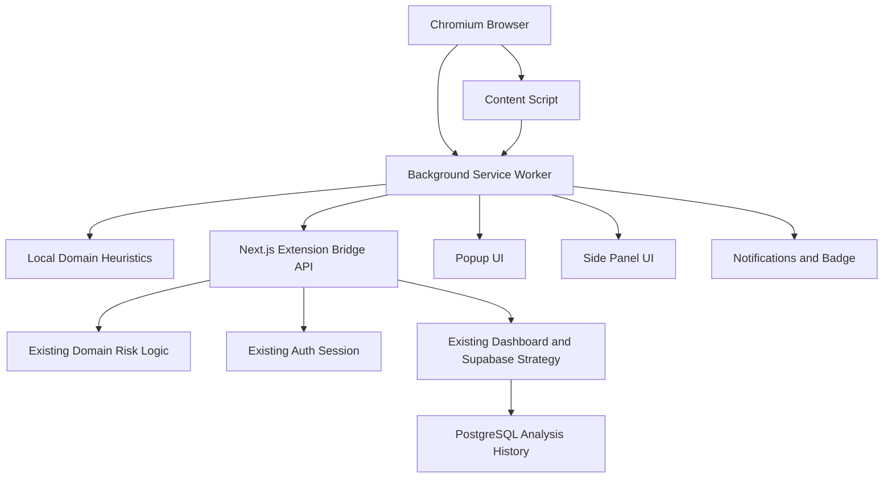
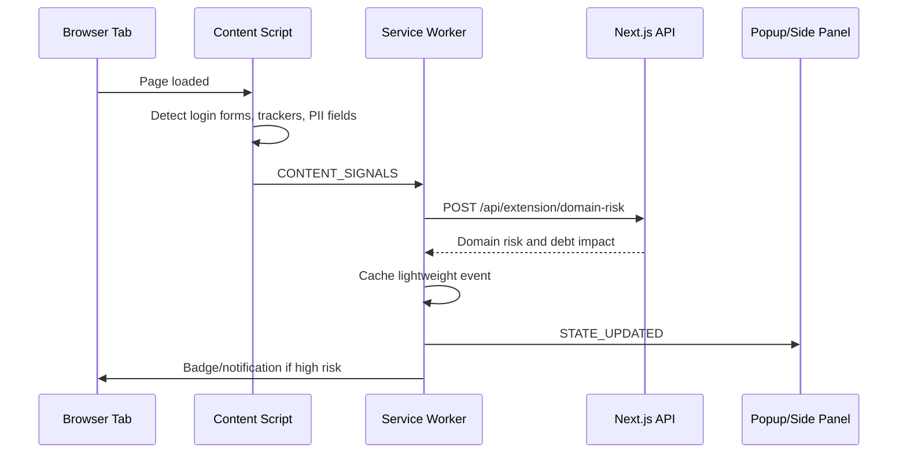

# Explainable Browser-Assisted Privacy Debt Intelligence System

## 1. Architecture Plan

The existing Privacy Debt Visualizer remains the primary web dashboard, backend, database, recommendation layer, and ML orchestration system. The browser extension is added as a companion telemetry and feedback layer. It observes privacy-risk signals in the browser, performs lightweight local checks, calls the existing backend for authoritative domain-risk analysis, and displays live feedback through popup, badge, notifications, and the Chrome Side Panel API.



## 2. Extension Folder Structure

```text
extension/
  manifest.json
  package.json
  tsconfig.json
  vite.config.ts
  postcss.config.cjs
  styles.css
  ARCHITECTURE.md
  background/
    service-worker.ts
  content/
    content-script.ts
  popup/
    index.html
    main.tsx
    App.tsx
  sidepanel/
    index.html
    main.tsx
    App.tsx
  shared/
    domain.ts
    storage.ts
  services/
    api-client.ts
  hooks/
    use-extension-state.ts
  types/
    index.ts
```

## 3. Manifest V3

The extension uses MV3 with:

- `background.service_worker` for orchestration
- `content_scripts` for DOM-safe signal detection
- `side_panel.default_path` for live risk dashboard
- `action.default_popup` for compact status
- `notifications` for high-risk alerts
- `downloads` for suspicious download warnings
- `storage` for minimal local state

## 4. Service Worker Architecture

The background worker is the coordinator. It:

- Monitors tab changes
- Normalizes current URLs
- Receives content-script signals
- Calls `/api/extension/domain-risk`
- Falls back to local heuristics when backend is unavailable
- Updates extension badge state
- Sends notifications for high-risk domains or downloads
- Caches recent risk events in `chrome.storage.local`
- Broadcasts state updates to popup and side panel

## 5. Content Script Structure

The content script inspects only page metadata and DOM structure. It detects:

- Login forms
- PII-style fields
- Cookie consent banners
- Tracker-like resource URLs
- Third-party request volume

It does not collect raw passwords, typed values, form contents, page text beyond consent-banner pattern checks, or complete browsing history.

## 6. Popup UI Structure

The popup is a compact control surface:

- Monitoring pause/resume
- Cumulative privacy debt score
- Current site risk
- Top red flags
- Button to open side panel

## 7. Side Panel UI Structure

The side panel is the live browser dashboard:

- Cumulative privacy debt score
- Current domain analysis
- Tracker count
- Privacy debt impact
- Recent risk events
- Red flags and explanations
- Future link back to the full web dashboard

## 8. API Integration Layer

The extension API client calls:

```http
POST /api/extension/domain-risk
```

Payload:

```json
{
  "domain": "paypa1-login.xyz",
  "signals": {
    "trackerCount": 12,
    "thirdPartyRequestCount": 47,
    "loginFormDetected": true,
    "piiFieldCount": 2,
    "consentBannerDetected": true
  }
}
```

Response:

```json
{
  "source": "privacy_debt_backend",
  "domains": [
    {
      "domain": "paypa1-login.xyz",
      "risk_score": 91,
      "risk_level": "Critical",
      "red_flags": ["Possible typosquatting", "High-risk TLD"],
      "privacy_debt_impact": 18
    }
  ]
}
```

## 9. Event Flow



## 10. Message Passing Architecture

Messages:

- `CONTENT_SIGNALS`: content script sends site metadata to background
- `GET_STATE`: popup and side panel request current state
- `STATE_UPDATED`: background broadcasts updated state
- `SET_PAUSED`: popup or side panel pauses monitoring
- `ANALYZE_ACTIVE_TAB`: reserved for manual re-analysis

## 11. Security Model

The extension follows MV3 security constraints:

- No remote script execution
- CSP-safe bundled scripts
- Minimal persistent state
- Backend requests use the existing server-side session
- No raw passwords or form values are captured
- Domain scoring is performed by existing server logic where possible
- Local logic is a fallback and pre-filter, not the source of truth

## 12. Privacy Model

Collected data is minimized to:

- Domain
- Risk features
- Tracker count
- Third-party request count
- Login form presence
- PII field count
- Consent-banner presence
- Download origin risk

The extension avoids:

- Raw browsing history upload
- Password capture
- Form-value capture
- Full page content capture
- Sensitive user text collection

Users can pause monitoring from the popup or side panel.

## 13. Integration Strategy

What runs locally in the extension:

- URL normalization
- Levenshtein brand similarity pre-check
- Suspicious keyword checks
- Tracker counting
- Login/PII field detection
- Badge and notification updates
- Lightweight event cache

What runs on the backend:

- Authenticated API validation
- Authoritative domain-risk scoring
- Existing scoring architecture
- Future extension event persistence
- Recommendation generation
- Dashboard sync

What remains in the web app:

- Full simulator
- Main dashboard
- Historical analysis view
- User authentication screens
- Analysis visualization
- Recommendations and explainability panels

## 14. Migration Strategy

1. Preserve the existing web app unchanged as the canonical dashboard.
2. Add the extension folder as a separate MV3 package.
3. Add only narrow backend bridge APIs for extension-specific signals.
4. Reuse the existing domain-risk logic instead of duplicating backend scoring.
5. Add persistence for extension events in a future migration if long-term browser telemetry is required.
6. Surface extension snapshots in the existing dashboard after persistence is introduced.

## 15. Implementation Order

1. Add MV3 manifest and build pipeline.
2. Implement background service worker.
3. Implement content script signal detection.
4. Implement domain-risk bridge API.
5. Implement popup status UI.
6. Implement side panel live dashboard.
7. Add notification and badge behavior.
8. Add download warning handling.
9. Add authenticated dashboard sync.
10. Add production permission review and privacy notice.

## 16. MVP Roadmap

MVP:

- Domain visit monitoring
- Local typosquatting detection
- Backend domain risk call
- Tracker count
- Side panel
- Popup
- Notifications
- Pause/resume

Phase 2:

- Persist extension risk events
- Show browser-assisted events in the main dashboard
- Add recommendation sync
- Add domain allowlist and user controls

Phase 3:

- Real-time accumulation and decay model
- External threat intelligence
- User-specific risk baselines
- OAuth permission debt detection
- Organization/team privacy debt dashboards

## 17. Advanced Future Features

- Federated or local-first risk scoring
- Per-domain privacy debt trendline
- Consent fatigue detection
- Shadow-profile exposure estimation
- Browser permission risk inventory
- Download reputation lookup
- Full dashboard merge of simulator and extension risk
- Explainable alert narratives powered by the recommendation engine
